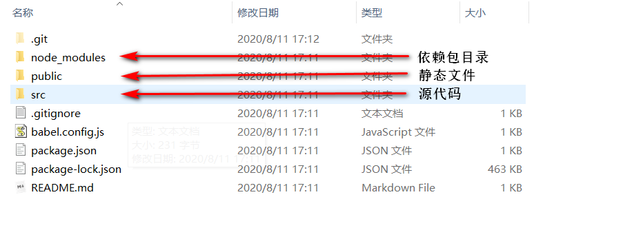
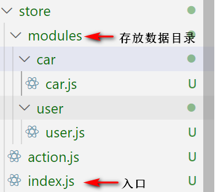
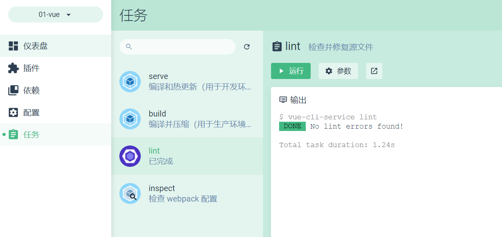

# 1 vue脚手架

## 1.1 安装插件

```
npm install -g @vue/cli
```

## 1.2 创建项目

```
vue create my-project
```

## 1.3 项目结构



# 2  Element-UI 

官网地址为： https://element.eleme.cn/#/zh-CN

## 2.1 安装 

```
npm i element-ui -S
```

## 2.2 导入资源 

```
// 导入组件库
import ElementUI from 'element-ui'; 
// 导入组件相关样式 
import 'element-ui/lib/theme-chalk/index.css'; 
 // 配置 Vue 插件
Vue.use(ElementUI); 
```

## 2.3 添加代码

```
<el-button type="primary">主要按钮</el-button>
```

# 3 vue路由

## 3.1 安装

```
npm install vue-router
```

## 3.2 创建路由

### 3.2.1  创建文件

在src文件中创建router目录，目录创建成功后，创建index.js文件

### 3.2.2 引入模块

```
import Vue from "vue";
import Router from "vue-router";

Vue.use(Router);
```

### 3.2.3 路由懒加载

```
const Home = () => import("../views/Home.vue");
const Login = () => import("../views/Login.vue");
```

### 3.2.4 创建Router

```
const router = new Router({
  routes: [
    { path: "/", component: Home },
    { path: "/login", component: Login },
  ],
});
```

### 3.2.5 导航守卫

```
// 挂载路由导航守卫
router.beforeEach((to, from, next) => {
  // to 将要访问的路径
  // from 代表从哪个路径跳转而来
  // next 是一个函数，表示放行
  //     next()  放行    next('/login')  强制跳转

  if (to.path === "/login") return next();
  // 获取token
  const tokenStr = window.sessionStorage.getItem("token");
  if (!tokenStr) return next("/login");
  next();
});
```

### 3.2.6 导出

```
export default router;
```

## 3.3 引入路由

```
import router from "./router";
new Vue({ router, render: (h) => h(App) }).$mount("#app");
```

# 4，网络模块

## 4.1 下载axios

```
npm install axios
```

## 4.2 封装模块

src目录下面创建net文件夹

### 4.2.1 封装联网部分

在net目录创建ajax.js文件

1，引入模块

```
import axios from "axios";
import qs from "qs";
```

2，创建axios

```
const http = axios.create({
  baseURL: "http://localhost:9999",
  timeout: 1000 * 180,
});
```

3，设置拦截器

```
// 添加请求拦截器
http.interceptors.request.use(
  function(config) {
    // 在发送请求之前做些什么
    return config;
  },
  function(error) {
    // 对请求错误做些什么
    return Promise.reject(error);
  }
);

// 添加响应拦截器
http.interceptors.response.use(
  function(response) {
    // 对响应数据做点什么

    if (response.status == 200) {
      return response.data;
    } else {
      return { code: -1, msg: "请求失败！" };
    }
  },
  function(error) {
    // 对响应错误做点什么
    return Promise.reject(error);
  }
);
```

4，封装get方法

```
const get = function(api, object) {
  //如果对象为空，就创建一个空对象
  if (object == null) object = {};
  let promise = http.get(api, {
    params: object,
  });
  return promise;
};
```

5，封装post

```
const post = function(api, object) {
  if (object == null) object = {};
  let promise = http.post(api, qs.stringify(object));
  return promise;
};
```

6，封装文件上传

```
const uploadFile = function(api, object) {
  if (object == null) object = {};
  let param = new FormData();
  for (let key in object) {
    param.append(key, object[key]);
  }
  let config = {
    headers: {
      "Content-Type": "multipart/form-data",
    },
  }; //添加请求头
  let promise = http.post(api, param, config);
  return promise;
};
```

7，导出

```
export { get, post, uploadFile };
```

### 4.2.2 封装api部分

1，引入联网模块

```
import { get, post } from "./ajax";
```

2，创建api

```
const login = (ob) => post("/login", ob);
const home = (ob) => get("/home", ob);
```

3，导出api

```
let api = {
  reqLogin: login,
  reqHome: home,
};
export default api;
```

### 4.2.3 挂载联网

```
import http from "./net/api";
Vue.prototype.$http = http;
```

## 4.3 应用

1，创建函数

```
   async getHome() {
      let res = await this.$http.reqHome();
      console.log(res);
    },
```

2，调用函数

```
this.getHome();
```


# 5 vuex

## 5.1 安装

### 5.1.1 下载

```
npm install vuex --save
```

### 5.1.2 安装

```
import Vue from 'vue'
import Vuex from 'vuex'

Vue.use(Vuex)
```

### 5.1.3 创建相应目录和文件

 

## 5.2 创建action文件

```
const CAR_LIST = "CAR_LIST"; //获得汽车信息

const USER_SET = "USER_SET"; //设置用户信息

export { CAR_LIST, USER_SET };
```

## 5.3 创建存储文件

```
import { USER_SET } from "../../action";

let user = sessionStorage.getItem("user")
  ? JSON.parse(sessionStorage.getItem("user"))
  : {};

const state = () => ({
  user: user,
  title: "登录页面",
});
const getters = {
  title: (state) => {
    return state.title;
  },
  user: (state) => {
    return state.user;
  },
};
const mutations = {
  [USER_SET](state, user) {
    state.user = user;
  },
};

const actions = {
  [USER_SET](context, user) {
    context.commit(USER_SET, user);
  },
};

export default {
  namespaced: true, // 增加命名空间
  state,
  mutations,
  actions,
  getters,
};
```

## 5.4 创建引入文件

```
import Vue from "vue";
import Vuex from "vuex";
import user from "./modules/user/user";
import car from "./modules/car/car";

Vue.use(Vuex);

const store = new Vuex.Store({
  modules: {
    user,
    car,
  },
});
export default store;
```

## 5.5 应用

### 5.5.1 引入文件

```
import { mapActions, mapGetters } from "vuex";
import { USER_SET } from "../store/action";
```

### 5.5.2  mapActions

```
methods: {
    async login() {
      let res = await this.$http.reqLogin({
        name: "wangzhijun",
        passwd: 123456,
      });
      window.sessionStorage.setItem("token", true);
      this.$router.push("/");
      this.setUser(res.user);
    },

    ...mapActions("user", {
      setUser: USER_SET,
    }),
  },
```

### 5.5.3 mapGetters

```
computed: {
    ...mapGetters("user", { user: "user", title: "title" }),
  }
```

# 6 工具箱

## 6.1 创建jsTool.js文件

```
export function transform(val) {
    let obj = val.replace(/[\[]/, "@gh")
    let str = obj.replace(/[\]]/, "@hg")
    return str
}
export function transform1(val) {
    let obj = val.replace(/\@gh/, "[")
    let str = obj.replace(/\@hg/, "]")
    return str
}
export function decimals() {
    let dec = value=value.match(/^\d*(\.?\d{0,2})/g)[0] || null
    return dec
}
```

## 6.2 validate.js

```
export function isEmail (s) {
  return /^([a-zA-Z0-9._-])+@([a-zA-Z0-9_-])+((.[a-zA-Z0-9_-]{2,3}){1,2})$/.test(s)
}

export function isMobile (s) {
  return /^1[0-9]{10}$/.test(s)
}

export function isPhone (s) {
  return /^([0-9]{3,4}-)?[0-9]{7,8}$/.test(s)
}

export function isURL (s) {
  return /^http[s]?:\/\/.*/.test(s)
}
```

## 6.3 index.js

```
import jsTool from "./jsTool";
import validate from "./validate";

export default { jsTool: jsTool, validate: validate };
```

## 6.4 挂载工具箱

```
import utlis from "./utils/index";
Vue.prototype.$utlis = utlis;
```

# 7 配置文件

## 7.1 config配置文件

创建config目录，并且在config目录下创建index.js

```
let host, api_url;
let type = process.env.NODE_ENV;
if (type == "development") {
  // 开发环境
  host = "http://localhost:9999";
  api_url = "/api";
}
if (type == "production") {
  // 生成环境
  host = "http://localhost:9999";
  api_url = "/api";
}

export { host, api_url };
```

## 7.2 创建vue.config.js文件

```
import { host } from "./src/config/index";
module.exports = {
  // 配置跨域
  devServer: {
    proxy: {
      "/api": {
        target: host, // 接口的域名
        // secure: false,  // 如果是https接口，需要配置这个参数
        changeOrigin: true, // 如果接口跨域，需要进行这个参数配置，为true的话，请求的header将会设置为匹配目标服务器的规则（Access-Control-Allow-Origin）
        pathRewrite: {
          "^/api": "", //本身的接口地址没有 '/api' 这种通用前缀，所以要rewrite，如果本身有则去掉
        },
      },
    },
  },
};
```

# 8 项目优化

## 8.1 可视化查找

当前项目输入启动可视化

```
vue ui
```



【任务】->【lint】->【运行】

## 8.2 不同模式

​		Vue项目的开发模式与发布模式，共用同一个打包的入口文件（即 src/main.js）。为了将项目 的开发过程与发布过程分离，我们可以为两种模式，各自指定打包的入口文件

- 开发模式的入口文件为 src/main-dev.js

- 发布模式的入口文件为 src/main-prod.js 

  vue.config.js 导出的配置对象中，chainWebpack 来自定义 webpack 的打包配置。 

```
chainWebpack: (config) => {
    config.when(process.env.NODE_ENV === "production", (config) => {
      config
        .entry("app")
        .clear()
        .add("./src/main-prod.js");
    });
    config.when(process.env.NODE_ENV === "development", (config) => {
      config
        .entry("app")
        .clear()
        .add("./src/main-dev.js");
    });
  },
```

## 8.3  CDN 资源 

​		默认情况下，通过 import 语法导入的第三方依赖包，最终会打包到一个文件中，但单文件体积过大的问题。

​		为了解决上述问题，可以通过 webpack 的 externals节点，来配置并加载外部的 CDN 资源。凡是声明在 externals 中的第三方依赖包，都不会被打包。 

### 8.3.1 配置

```
config.set('externals', { 
  vue: 'Vue', 
  'vue-router': 'VueRouter', 
  axios: 'axios', 
  lodash: '_', 
  echarts: 'echarts', 
  nprogress: 'NProgress', 
  'vue-quill-editor': 'VueQuillEditor' 
})
```

### 8.3.2  加载外部 CDN 资源 

 public/index.html 文件的头部，添加如下的 CDN 资源引用

```
<script src="https://cdn.staticfile.org/vue/2.5.22/vue.min.js"></script> 
<script src="https://cdn.staticfile.org/vue-router/3.0.1/vue-router.min.js"></script> 
<script src="https://cdn.staticfile.org/axios/0.18.0/axios.min.js"></script>
```

## 8.4  优化 ElementUI

通过 CDN 的形式来加 载，这样能够进一步减小打包后的文件体积。 

- main.js 中，注释掉 element-ui 按需加载的代码
- index.html 的头部区域中，通过 CDN 加载 element-ui 的 js 和 css 

```
<!-- element-ui 的样式表文件 --> 
<link rel="stylesheet" href="https://cdn.staticfile.org/elementui/2.8.2/themechalk/index.css" /> 
<!-- element-ui 的 js 文件 --> 
<script src="https://cdn.staticfile.org/elementui/2.8.2/index.js"></script> 
```

## 8.5 首页内容定制 

### 8.5.1 配置

​		在vue.config.js以通过插件的方式进行定制。

```
  chainWebpack: (config) => {
    config.when(process.env.NODE_ENV === "production", (config) => {
  
      config.plugin("html").tap((args) => {
        args[0].isProd = true;
        return args;
      });
    });
    config.when(process.env.NODE_ENV === "development", (config) => {
      config.plugin("html").tap((args) => {
        args[0].isProd = false;
        return args;
      });
    });
  },
```

### 8.5.2 首页渲染

​		首页根据isProd 的值，来决定如何渲染页面结构。

```
<!– 按需渲染页面的标题 --> 
<title><%= htmlWebpackPlugin.options.isProd ? '' : 'dev - ' %>电商后台管理系统</title> 
 
<!– 按需加载外部的 CDN 资源 --> 
<% if(htmlWebpackPlugin.options.isProd) { %> 
	<!—通过 externals 加载的外部 CDN 资源--> 
<% } %>
```

## 8.6 路由懒加载 

​		当打包构建项目时，JavaScript 包会变得非常大，影响页面加载。如果我们能把不同路由对应的组件分割成 不同的代码块，然后当路由被访问的时候才加载对应组件，这样就更加高效了。 

```
const Foo = () => import(/* webpackChunkName: "group-foo" */ './Foo.vue') 
```

# 9 项目上线

## 9.1  创建服务器

通过 express 快速创建 web 服务器，将 vue 打包生成的 dist 文件夹

```
const express = require("express");
// 创建 web 服务器
const app = express();

// 托管静态资源
app.use(express.static("./dist"));

// 启动 web 服务器
app.listen(8888, () => {
  console.log("启动服务器");
});
```

## 9.2  开启gzip配置 

gzip 可以减小文件体积，使传输速度更快

安装相应包：

```
npm install compression -S   
```

代码：

```
// 导入包   
  const compression = require('compression');   
  // 启用中间件   
  app.use(compression());
```

## 9.3  配置HTTPS服务

为什么要启用 HTTPS 服务？ 

- 传统的 HTTP 协议传输的数据都是明文
- HTTPS 协议对传输的数据进行了加密处理

### 9.3.1  申请流程

- 进入 https://freessl.cn/ 官网，输入要申请的域名并选择品牌
- 输入自己的邮箱并选择相关选项
- 验证 DNS（在域名管理后台添加 TXT 记录）
- 验证通过之后，下载 SSL 证书（ full_chain.pem 公钥；private.key 私钥）。 

### 9.3.2  配置 HTTPS 服务 

```
  const https = require('https'); 
  const fs = require('fs'); 
  const options = { 
      cert: fs.readFileSync('./full_chain.pem'), 
      key: fs.readFileSync('./private.key') 
  } 
  https.createServer(options, app).listen(443);
```

## 9.4 管理应用 

1. 在服务器中安装 pm2：npm i pm2 -g
2. 启动项目：pm2 start 脚本 --name 自定义名称
3. 查看运行项目：pm2 ls
4. 重启项目：pm2 restart 自定义名称
5. 停止项目：pm2 stop 自定义名称
6. 删除项目：pm2 delete 自定义名称